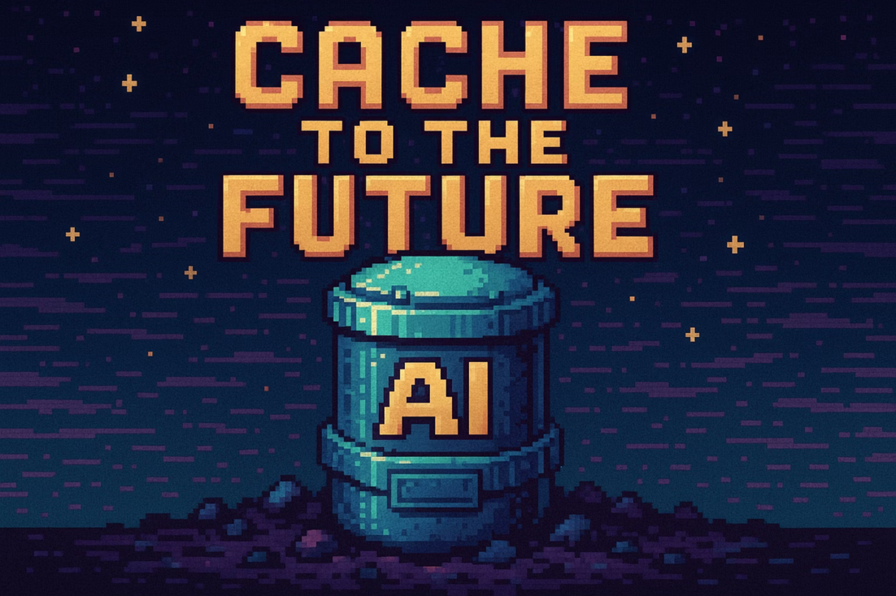

  

# 🌌 Cache to the Future

A digitalised version of time-capsule memory system in React, encrypted to unlock only when the countdown ends, plus a custom SVG typewriter keyboard for a unique user experience. 

👉 **View the project here:** [Published Link](https://cache-to-the-future.vercel.app/)

---

## 🚀 How We Built It
- **React** for the front-end  
- **Custom SVG-based typewriter keyboard** for a nostalgic user experience  
- **Encryption system** locks the message with a key only generated after the set time expires  
- **Decryption key** is supplied to the user on a time-based schedule  

---

## 📜 About the Project
**How does it fit with the theme?**  
- The revival of traditions through modern tools: just as the Macintosh once revolutionized households, this blends cultural heritage with cryptography to bring old memories into the digital future.
- It’s nostalgia and innovation combined, acting as a reminder that some retro ideas deserve a comeback — especially when technology makes them better.  

**Key Feature:**
- Message encryption  
- Decrypted after set period of time  
- Accessible to anyone with a digital device
- AI-powered text-to-speech conversion for increased accessibility (Coming Soon)

---

## 🤝 Team & Contributions
Developed collaboratively during QUT Hackathon 2025 by: 
- [Jesse Wei](https://github.com/mrjwei)  
- [John Wynter](https://github.com/JohnJohnW)  
- [Anant Srivastava](https://github.com/Gunsmoke09)  
- Yee Wei Lim  
- Kalin Panmanee
- Ayako Neko (this repo)  

---

## 🏆 Awards & Recognition
- 🥇 **Best First Year Award** – QUT Hackathon 2025  